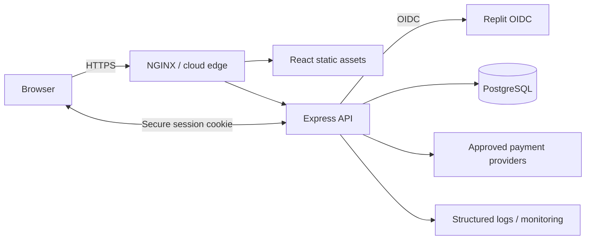

# System Architecture

## Context

GOFAPS is a government operations and financial management web application. A React single-page application calls an Express API over HTTPS. The server owns authentication, authorization, validation, business workflows, and persistence through Drizzle ORM to PostgreSQL. The application also exposes WebSocket connections for live updates and integrates with approved payment and identity providers.

## Runtime boundaries

| Boundary | Responsibility | Security expectation |
|---|---|---|
| Browser | Presentation and user interaction | No secrets; treat all input as untrusted |
| Edge/reverse proxy | TLS termination, routing, and request controls | HTTPS only; preserve forwarding headers from trusted proxies |
| Express server | API, OIDC session handling, validation, and workflows | Authenticate protected routes; least-privilege provider credentials |
| PostgreSQL | Application data and server-side sessions | Private network, encrypted connections, backups, restricted role |
| External providers | Identity and payment capabilities | Approved endpoints, scoped credentials, audit logging, timeouts |

## Request and authentication flow

1. A browser requests `GET /api/login`.
2. The server redirects it to the configured OIDC provider using Authorization Code flow.
3. The provider returns the browser to `GET /api/callback`; the server validates the response, upserts the user, and creates a server-side PostgreSQL session.
4. The browser sends the secure, HTTP-only session cookie on API requests. Protected endpoints return `401` when the session is absent or cannot be refreshed.
5. Organization-scoped handlers derive organization and user identifiers from the authenticated server-side identity, not client-supplied ownership fields.

See the [OpenAPI specification](../api/openapi.yaml) for the contract and [ADR 0001](../adr/0001-deployment-model.md) for runtime deployment decisions.

## Deployment topology

The supported production baseline is a Linux VM on UpCloud, AWS EC2, or Azure VM. Docker Compose builds and starts the application on the selected target; NGINX fronts the service. GitHub Actions provides manual, environment-bound deployment orchestration. PostgreSQL must be independently backed up and must not be colocated without an explicit risk acceptance.

Deployments progress through `dev`, `staging`, and `production`. Each environment has isolated configuration and secrets. Production requires a human approval and post-deployment readiness validation. See [ADR 0003](../adr/0003-environment-gating.md).

## Observability and reliability

- Use `/health/live` for process liveness and `/health/ready` for traffic readiness.
- Centralize structured application and reverse-proxy logs with environment, release SHA, request ID, route, status, and duration fields; never log credentials, tokens, cookies, or sensitive financial data.
- Alert on sustained readiness failures, elevated 5xx rates, authentication failures, latency regressions, database saturation, and disk exhaustion.
- Record every release SHA and retain the previous known-good release for rollback.
- Test database restore procedures on a non-production environment at least quarterly.

## Decision record policy

Significant architecture, security, deployment, and data-lifecycle decisions require an immutable numbered ADR in `docs/adr`. Superseding an ADR requires a new record that links to the earlier decision; accepted records are not silently rewritten.
